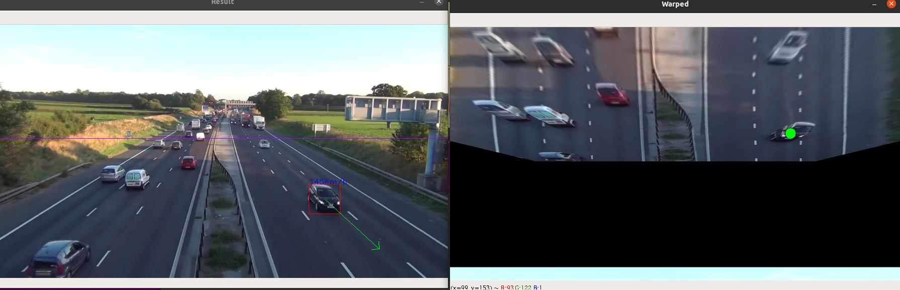

# Car-Speed-Monitor-Yolo-and-Flow-Estimation
Yolov3 and flow based algorithms to detect the car RELATIVE speed.

## Warning!
This is some scripts I've made for tests and/or meaningless projects. They are not made to be easy to understand, optimized nor working. They surely have some interesting stuff so for any questions please talk to me in [Linkedin](https://www.linkedin.com/in/diego-bonilla-salvador/).
